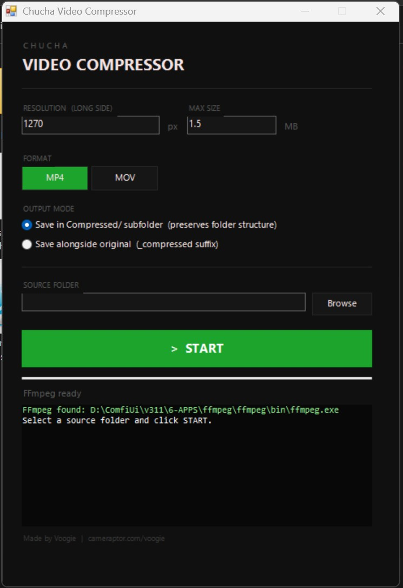

# 🐱 Chucha Video Compressor

[](https://github.com/Cameraptor/Chucha-Video-Compressor)
[](LICENSE)
[](https://github.com/Cameraptor/Chucha-Video-Compressor/releases)
[]()
[](https://t.me/voogieboogie)

<div align="center">
  
</div>

> **The fastest way to batch-compress videos to a target file size — no professional software needed. Just double-click and go.**

Free, portable, single-file `.exe` tool for Windows. Compresses any number of video files to a precise size limit using 2-pass H.264 encoding via x264 — the same encoder used by Netflix, YouTube, and professional studios. Produces significantly better visual quality at low bitrates compared to Adobe Media Encoder.

**Download `VideoCompressor.exe` → double-click → select folder → done.** That's it. No installation, no accounts, no subscriptions.

**Author:** Voogie | **Project:** Cameraptor | [cameraptor.com/voogie](https://cameraptor.com/voogie)

---

<div align="center">
  
</div>

---

## ✨ Key Features

| Feature | Description |
|---------|-------------|
| 🎯 **Target File Size** | Set exact MB limit — the tool calculates optimal bitrate automatically |
| 📦 **Batch + Subfolders** | Point to any folder — automatically discovers all videos in all subfolders, preserves directory structure in output |
| 🎬 **2-Pass x264** | Two-pass encoding with `preset slow` for maximum quality per byte |
| 🆚 **Better Than AME** | x264 encoder is ~20% more efficient than Adobe's MainConcept at low bitrates |
| 📐 **Resolution Control** | Set max long-side resolution (e.g. 1270 px) to further reduce file size |
| 💰 **100% Free** | No subscriptions, no accounts, no trials. MIT license, open source. |
| 📁 **Single EXE** | One file. No installation. Just download and run. Auto-installs FFmpeg if missing. |
| 🛡️ **Safe Processing** | Originals are never touched — output goes to a `Compressed/` subfolder |
| ⏹️ **STOP Button** | Cancel at any time without corrupting files |
| 🔍 **Pre-flight Analyzer** | Warns you before encoding if a file can't physically fit in your size limit |

---

## 🆚 Why Not Adobe Media Encoder?

Adobe Media Encoder defaults to **VBR 1 Pass** encoding with its built-in **MainConcept** H.264 encoder. While it does support 2-pass mode, there are significant real-world problems:

- **2-pass requires software encoding** — disables GPU acceleration, making it very slow
- **2-pass is buggy** — [documented cases](https://community.adobe.com/t5/adobe-media-encoder-discussions/media-encoder-only-does-1-pass-with-vbr-2-pass-settings-software-encoding/td-p/14743829) where AME silently performs only 1 pass even when 2-pass is selected
- **Target file size is unreliable** — users [report setting 4 MB limits and getting 36 MB files](https://community.adobe.com/t5/adobe-media-encoder-discussions/max-file-size-does-nothing/m-p/15178705)
- **Metadata bloat** — Content Credentials and metadata can inflate small files unexpectedly
- **Can't go below ~5 MB** — users [report being unable to get H.264 files smaller than 5 MB](https://creativecow.net/forums/thread/cant-get-h264-files-smaller-than-5mb-out-of-media/) even at very low bitrates
- **MainConcept vs x264** — independent testing shows [x264 is ~20% more efficient](https://www.streamingmedia.com/Articles/ReadArticle.aspx?ArticleID=147394) at equivalent quality

**Chucha uses 2-pass VBR encoding with x264:** the first pass analyzes the entire video, the second pass distributes bits intelligently. Complex scenes get more bitrate, simple scenes get less. At low bitrates (1–3 MB target), the quality difference is clearly visible.

| | Adobe Media Encoder | Chucha Video Compressor |
|---|---|---|
| **Encoder** | MainConcept (less efficient) | x264 (industry standard) |
| **2-Pass** | Buggy, disables GPU, sometimes silently falls back to 1-pass | Always works, reliable |
| **Target file size** | Unreliable — often overshoots by 5–10x | Precise — hits target consistently |
| **Min achievable size** | ~5 MB floor | No floor — goes as low as needed |
| **Batch processing** | Manual queue, one file at a time | One-click folder scan with subfolders |
| **Setup** | Creative Cloud subscription ($55/month) | Free. Single `.exe`. No install. |
| **Encoding speed** | 2-pass is ~4x slower than ffmpeg | Fast 2-pass via optimized x264 |

---

## 📦 Download

> **You only need one file — `VideoCompressor.exe`. That's it.**

1. Download **`VideoCompressor.exe`** from [Releases](https://github.com/Cameraptor/Chucha-Video-Compressor/releases)
2. Put it anywhere on your PC
3. Double-click to launch

No installation. No dependencies to manage. No accounts.

> 💡 **FFmpeg:** The tool auto-detects FFmpeg on your system (checks PATH, common install locations, winget packages). If not found, it installs it automatically via `winget` — you don't need to do anything.

---

## 🕹️ Usage Guide

1. **Set resolution** — max long side in pixels (default: 1270)
2. **Set max size** — target file size in MB (default: 1.5)
3. **Choose format** — MP4 or MOV
4. **Choose output mode:**
   - `Compressed/` subfolder (preserves folder structure)
   - Alongside original with `_compressed` suffix
5. **Browse** for a source folder
6. Click **START**

The tool automatically discovers all video files in the selected folder **and all subfolders** — no need to select files one by one. Directory structure is preserved in the output.

> 💡 **Pre-flight check:** Before compressing, the tool analyzes every file. If any video physically can't fit within your size limit (e.g. a 2-minute video at 1.5 MB), you'll get a warning showing the minimum achievable size for each file.

> ⏹️ **Stopping:** Click STOP to cancel. The window won't close during processing — use STOP first.

---

## 📋 Parameters Reference

| Parameter | Default | Description |
|-----------|---------|-------------|
| **Resolution** | 1270 px | Maximum long-side dimension. Videos smaller than this won't be upscaled. |
| **Max Size** | 1.5 MB | Target file size. The encoder hits this as closely as possible. |
| **Format** | MP4 | Output container — MP4 (H.264 + AAC) or MOV (H.264 + AAC). |
| **Output Mode** | Subfolder | `Compressed/` subfolder preserves the original directory tree. |

### How Bitrate Is Calculated

```
total_budget  = max_size * 0.92          (8% container overhead)
audio_budget  = 96 kbps * duration
video_budget  = total_budget - audio_budget
video_bitrate = video_budget / duration   (min 80 kbps)
```

---

## 🛠️ Building from Source

The tool is a PowerShell WinForms application compiled to `.exe` via PS2EXE.

### Prerequisites

- Windows 10/11 with PowerShell 5.1+
- FFmpeg installed and in PATH

### Compile

```powershell
. .\ps2exe.ps1
Invoke-ps2exe .\VideoCompressor.ps1 .\VideoCompressor.exe `
    -noConsole -iconFile .\compressor.ico `
    -title 'Chucha Video Compressor' `
    -company 'CAMERAPTOR' `
    -copyright 'Voogie / cameraptor.com'
```

Or simply run:

```powershell
.\compile.ps1
```

### Source Structure

| File | Description |
|------|-------------|
| `VideoCompressor.ps1` | Main application — WinForms GUI + FFmpeg logic |
| `ps2exe.ps1` | PS2EXE compiler (converts PS1 to standalone EXE) |
| `compile.ps1` | One-click build script |
| `compressor.ico` | Application icon (16/32/48/256 px) |

---

## 🛡️ Technical Notes

- **x264 encoder** — the most efficient H.264 encoder available, used by Netflix, YouTube, and Handbrake. Consistently outperforms MainConcept (Adobe) and QuickSync (Intel) at low bitrates.
- **No pipes:** FFmpeg runs without stdout/stderr redirection to avoid deadlocks in the PS2EXE runtime. Progress is tracked via `-progress <tempfile>`.
- **mbtree disabled:** x264's MB-tree feature is turned off (`mbtree=0`) to prevent incomplete stats files that corrupt output on certain clips.
- **Explicit passlogfile:** 2-pass log files use explicit temp paths instead of relying on the working directory, avoiding CWD mismatches between PowerShell and Win32.
- **Audio budget:** Audio is encoded at 96 kbps AAC. The bitrate calculator subtracts audio from the total budget before computing video bitrate.

---

## 🔧 Troubleshooting

| Issue | Solution |
|-------|----------|
| FFmpeg not found | Install via `winget install Gyan.FFmpeg` or place `ffmpeg.exe` next to the app |
| UAC prompt on launch | Re-download the EXE — it should not require admin privileges |
| Output larger than target | Expected for very long videos at small size limits — pre-flight warning will explain |
| App won't close | Click STOP first to cancel processing, then close normally |
| Antivirus flags EXE | PS2EXE-compiled scripts are sometimes flagged as false positives. Add an exception or run the `.ps1` directly. |

---

## 🤝 Support & Community

- **💬 Telegram:** [Join @voogieboogie](https://t.me/voogieboogie) — questions, feedback, feature requests
- **🐛 Issues:** [GitHub Issues](https://github.com/Cameraptor/Chucha-Video-Compressor/issues)
- **🌐 Website:** [cameraptor.com/voogie](https://cameraptor.com/voogie)

---

## 📄 License

MIT License — See [LICENSE](LICENSE) file for details.

---

<div align="center">

**Made with ❤️ by Voogie | Cameraptor**

[](https://t.me/voogieboogie)

⭐ Star this repo if you find it useful!

</div>
