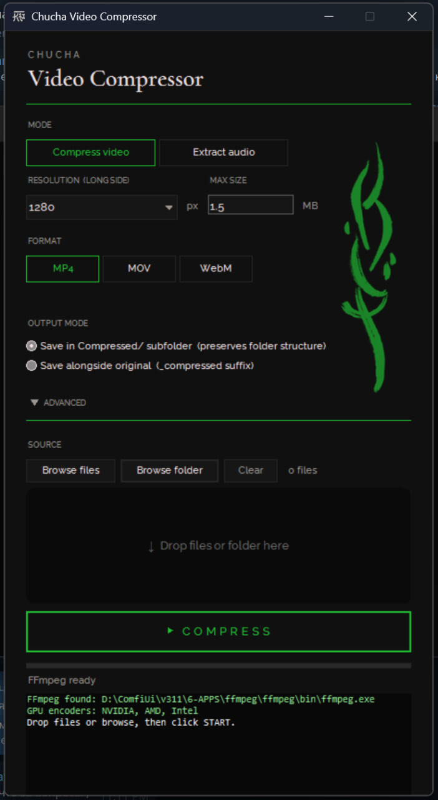

# Chucha Video Compressor

[](https://github.com/Cameraptor/Chucha-Video-Compressor)
[](LICENSE)
[](https://github.com/Cameraptor/Chucha-Video-Compressor/releases)
[](https://github.com/Cameraptor/Chucha-Video-Compressor/releases)
[]()
[](https://t.me/voogieboogie)

<table width="100%" cellspacing="0" cellpadding="0"><tr>
<td width="45%" bgcolor="#101010" align="center" valign="middle"></td>
<td width="55%"></td>
</tr></table>

> **Compress any video to a precise target file size. GPU-accelerated. Drag-and-drop. Free.**

Free, portable, single-file tool for **Windows** and **macOS**. Drop your files, set the MB limit, press Compress — done. Supports H.264, H.265, and WebM/VP9 output with hardware-accelerated encoding on NVIDIA, AMD, and Intel GPUs.

**Download → double-click → drop files → done.** No installation, no accounts, no subscriptions.

> **macOS version available** — same compression engine, terminal-based with native macOS dialogs. Identical encoding quality.

**Author:** Voogie | **Project:** CAMERAPTOR | [cameraptor.com/voogie](https://cameraptor.com/voogie)

---

## What's New in v2

The entire app was rebuilt from scratch. Here's what changed:

| | v1 | v2 |
|---|---|---|
| **Input** | Folder picker only (Windows 95-style dialog) | Drag-and-drop files and folders + modern Windows file picker |
| **Codecs** | H.264 only | H.264 · H.265 · WebM/VP9 |
| **GPU** | CPU only | NVIDIA (NVENC) · AMD (AMF) · Intel (QSV) auto-detected |
| **Resolution** | Up to 1920 | Up to 4K (3840px) |
| **Audio** | Compression only | Compression + standalone audio extraction (MP3/AAC/WAV) |
| **UI** | Basic flat controls | Redesigned — dark titlebar, brand fonts, chip selectors, drop zone |
| **File picker** | FolderBrowserDialog (legacy) | IFileOpenDialog COM interop (native Windows Explorer UI) |

---

## Key Features

### Drag-and-Drop Input
Drop any mix of files and folders directly onto the app window. The tool recursively scans all dropped folders, finds every video, and mirrors the original folder structure in the output. No need to pick files one by one — drop the whole project folder and walk away.

### GPU Acceleration
NVIDIA, AMD, and Intel GPUs are auto-detected at startup. Select Auto to let the app pick the best available encoder, or lock it to a specific GPU. Hardware encoding is 5–10x faster than CPU for large files.

- **NVIDIA** — NVENC (h264_nvenc / hevc_nvenc)
- **AMD** — AMF (h264_amf / hevc_amf)
- **Intel** — QuickSync (h264_qsv / hevc_qsv)
- **CPU** — libx264 / libx265 with 2-pass for maximum quality

### H.264 · H.265 · WebM
- **H.264** — universal compatibility, 2-pass CBR via libx264
- **H.265** — 40% better compression at the same quality, 2-pass via libx265
- **WebM/VP9** — open format, libvpx-vp9 with libopus audio; 2-pass, no GPU (VP9 has no hardware encoder path)

### Audio Extraction Mode
Switch from video compression to audio extraction in one click. Select MP3, AAC, or WAV — the app strips the audio track from every file in the queue and saves it alongside the originals or in a subfolder.

### Target File Size — Precisely
Set the MB limit and the tool hits it. The bitrate is calculated per-file based on duration, codec efficiency, and audio budget. At low targets (1–3 MB), 2-pass encoding distributes bits where they matter — complex scenes get more, static scenes get less.

```
total_budget  = max_size × 0.92          (8% container overhead)
audio_budget  = 96 kbps × duration
video_bitrate = (total_budget − audio_budget) / duration
```

### Modern File Pickers
The folder and file dialogs now use `IFileOpenDialog` COM interop — the same native Windows Explorer dialog used by modern applications. No more Windows 95-era FolderBrowserDialog.

### Up to 4K
Resolution selector covers 480 → 720 → 1080 → 1280 → 1920 → 2560 → 3840. Choose the max long-side dimension — portrait and landscape videos both handled correctly (`if(gte(iw,ih))` conditional scale filter).

### Scale Algorithm
Pick between bicubic (default), lanczos (sharper downscale), or bilinear (fastest) depending on your content and time budget.

### Redesigned UI
- Native Windows dark titlebar (DWM `DWMWA_USE_IMMERSIVE_DARK_MODE`)
- Brand fonts — Cormorant Garamond + Raleway via embedded TTF
- Format and codec chip selectors (MP4 / MOV / WebM · H.264 / H.265)
- Drop zone with file list, count display, and individual file remove
- CAMERAPTOR brand palette — #21C134 Raptor Green

---

## Why Not Just Use [Adobe / DaVinci / Handbrake]?

You have a folder of videos. You need them under 2 MB each. Here's what happens when you try the usual tools:

### Adobe Media Encoder — $55/month, still broken

AME uses MainConcept H.264 — a less efficient encoder than x264. Then it adds its own problems on top:

- **"Max file size" literally does nothing** — [users report setting a 4 MB limit and getting 36 MB output](https://community.adobe.com/t5/adobe-media-encoder-discussions/max-file-size-does-nothing/m-p/15178705). The setting exists. It just doesn't work.
- **2-pass disables GPU acceleration** — so your $800 GPU sits idle while your CPU slowly grinds through the encode
- **2-pass is silently broken** — [documented cases](https://community.adobe.com/t5/adobe-media-encoder-discussions/media-encoder-only-does-1-pass-with-vbr-2-pass-settings-software-encoding/td-p/14743829) where AME performs 1-pass even when 2-pass is selected, with no warning
- **Can't go below ~5 MB** — [users can't get H.264 files smaller than 5 MB](https://creativecow.net/forums/thread/cant-get-h264-files-smaller-than-5mb-out-of-media/) no matter how low they set the bitrate
- **Batch means building a queue manually** — drag each file in one by one, set settings for each

| | Adobe Media Encoder | Chucha |
|---|---|---|
| **Price** | $55/month | Free forever |
| **Encoder** | MainConcept | x264 / x265 / VP9 |
| **Hits target size** | Unreliable — overshoots 5–10× | Yes, consistently |
| **2-pass quality** | Buggy, sometimes silently 1-pass | Always correct |
| **Min file size** | ~5 MB floor | No floor |
| **GPU** | Disables for 2-pass | NVIDIA · AMD · Intel, always on |
| **Batch processing** | Manual queue per file | Drop a folder, done |

### DaVinci Resolve — incredible tool, wrong job

DaVinci is the best video editor on the planet. It's also 47 clicks to export one file to a target size. You need to: open a project, import clips, create a timeline, set in/out points, open Deliver page, configure codec settings, manually calculate bitrate from target size (no automatic calculation), render — repeat for every file. It's built for color grading feature films, not batch-compressing 30 clips from a shoot.

No target-size input. No batch folder scan. No drag-and-drop queue. Just a very powerful tool solving a very different problem.

### Handbrake — great encoder, missing the point

Handbrake uses x264/x265, so the encoding quality is on par. But:

- **No target file size** — you set bitrate manually, which means manually calculating it for each video based on its duration
- **No recursive batch** — you queue files one at a time; it won't scan a folder and preserve structure
- **No GPU 2-pass** — hardware encoding is single-pass only, no quality guarantee
- **No audio extraction** — it's a video transcoder, not an audio extractor

### What Chucha actually does

Drop a folder. Set 2 MB. Press Compress. Every video in every subfolder comes out under 2 MB, with the original folder structure preserved, encoded with the best available hardware on your machine. That's the whole thing.

---

## Download

### Windows

1. Download **`VideoCompressor.exe`** from [Releases](https://github.com/Cameraptor/Chucha-Video-Compressor/releases)
2. Put it anywhere — no installation needed
3. Double-click to launch

> FFmpeg is auto-detected. If not found, installed automatically.

### macOS

1. Download **`chucha-compress.command`** from [Releases](https://github.com/Cameraptor/Chucha-Video-Compressor/releases)
2. Double-click to launch in Terminal
3. If blocked: right-click → Open, or `chmod +x chucha-compress.command`

> FFmpeg auto-installed via Homebrew if missing.

---

## Usage

### Video Compression

1. Drop files or folders onto the drop zone — or use **Browse files** / **Browse folder**
2. Set **Resolution** (max long side in px) and **Max Size** (target MB)
3. Pick **Format** — MP4 / MOV / WebM
4. Pick **Codec** — H.264 / H.265
5. Choose **GPU** mode — Auto lets the app detect and use the best available
6. Select **Output mode** — subfolder (preserves structure) or alongside original
7. Click **COMPRESS**

### Audio Extraction

1. Click **Extract audio** at the top to switch modes
2. Drop your video files
3. Pick output format — MP3 / AAC / WAV
4. Click **COMPRESS**

> **Pre-flight check:** before encoding, the app warns you if any file physically can't fit in your size limit.

> **STOP:** cancels at any time without corrupting output.

---

## Parameters Reference

| Parameter | Default | Options | Description |
|-----------|---------|---------|-------------|
| **Mode** | Compress video | Compress video · Extract audio | Video compression or audio-only extraction |
| **Resolution** | 1280 px | 480 · 720 · 1080 · 1280 · 1920 · 2560 · 3840 | Max long-side dimension |
| **Max Size** | 1.5 MB | Any | Target file size in MB |
| **Format** | MP4 | MP4 · MOV · WebM | Output container |
| **Codec** | H.264 | H.264 · H.265 | Video codec (H.265 = ~40% better compression) |
| **GPU** | Auto | Auto · CPU · NVIDIA · AMD · Intel | Encoder selection |
| **Scale algo** | bicubic | bicubic · lanczos · bilinear | Downscale filter quality |
| **Output mode** | Subfolder | Subfolder · Alongside | Where output files are saved |
| **Threads** | Auto | 1–32 | FFmpeg thread count |

---

## Building from Source

### Windows

```powershell
.\compile.ps1
```

Requires: PowerShell 5.1+, `ps2exe.ps1` (included), `compressor.ico` (included).

### macOS

No build step — the `.command` script runs directly:

```bash
chmod +x chucha-compress.command
./chucha-compress.command
```

### Source Files

| File | Platform | Description |
|------|----------|-------------|
| `VideoCompressor.ps1` | Windows | WinForms GUI + all encoding logic (~2040 lines) |
| `chucha-compress.command` | macOS | Terminal app — osascript dialogs + FFmpeg |
| `ps2exe.ps1` | Windows | PS2EXE compiler (PS1 → standalone EXE) |
| `compile.ps1` | Windows | One-click build script |
| `compressor.ico` | Windows | Application icon |

---

## Technical Notes

- **2-pass CPU encoding** — pass 1 analyzes, pass 2 distributes bits. Temp log files written to `%TEMP%` with GUID names (no working directory dependency).
- **mbtree=0** — x264's MB-tree disabled to prevent incomplete stats on certain clips.
- **WebM container** — uses `-quality good -cpu-used 2` instead of `-preset`; no `-movflags` (not an MP4 container).
- **H.265 2-pass** — uses `x265-params pass=1/pass=2` (not the standard `-pass` flag).
- **GPU path** — single-pass constrained VBR. WebM/VP9 always falls back to CPU (no hardware VP9 encoder path in FFmpeg).
- **Fonts** — Cormorant Garamond SemiBold and Raleway Regular embedded as Base64-encoded TTF, loaded via `PrivateFontCollection`. WOFF2 is not supported by GDI+.
- **DPI** — native OS bitmap scaling preferred; `SetProcessDPIAware` intentionally disabled.

---

## System Requirements

| | Windows | macOS |
|---|---|---|
| **OS** | Windows 10 / 11 (x64) | macOS 10.15+ (Intel & Apple Silicon) |
| **RAM** | 4 GB | 4 GB |
| **GPU** | Optional (NVIDIA/AMD/Intel for HW encode) | — |
| **Runtime** | PowerShell 5.1 (built-in) | bash (built-in) |
| **FFmpeg** | Auto-installed via winget | Auto-installed via Homebrew |

---

## Troubleshooting

| Issue | Solution |
|-------|----------|
| FFmpeg not found (Windows) | `winget install Gyan.FFmpeg` or place `ffmpeg.exe` next to the app |
| FFmpeg not found (macOS) | `brew install ffmpeg` |
| GPU encoder not detected | Switch to CPU mode manually; verify GPU drivers are current |
| Output larger than target | Expected for very short videos at extreme size limits — pre-flight warning explains |
| App won't close | Click STOP to cancel processing first |
| Antivirus flags EXE | PS2EXE-compiled scripts are sometimes flagged as false positives. Add exception or run `.ps1` directly |
| macOS "unidentified developer" | Right-click → Open, or `chmod +x chucha-compress.command` |

---

## Support

- **Telegram:** [Join @voogieboogie](https://t.me/voogieboogie) — questions, feedback, feature requests
- **Issues:** [GitHub Issues](https://github.com/Cameraptor/Chucha-Video-Compressor/issues)
- **Website:** [cameraptor.com/voogie](https://cameraptor.com/voogie)

---

## License

MIT License — see [LICENSE](LICENSE) for details.

---

<div align="center">

**Made by Voogie | CAMERAPTOR**

[](https://t.me/voogieboogie)

⭐ Star the repo if it saves you time

</div>
